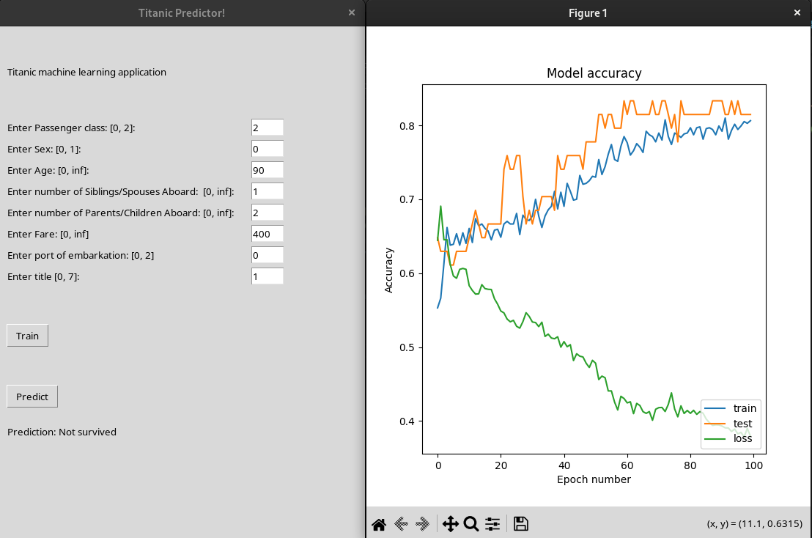

# About:
This is a test GUI application that uses the python module "Tkinter" for the GUI code and "keras"
for the machine learning and prediction code.

# Screenshots:
{ width=50% }

# Install requirements:
## Create a virtual python environment:
sudo apt install python3-pip python3-venv
python3 -m venv python_venv

## Activate the created virtual environment:
source ./python_venv/bin/activate

## Install all required python packages:
pip install --requirement ./requirements.txt

# Run the application:
python3 ./tk_gui.py

